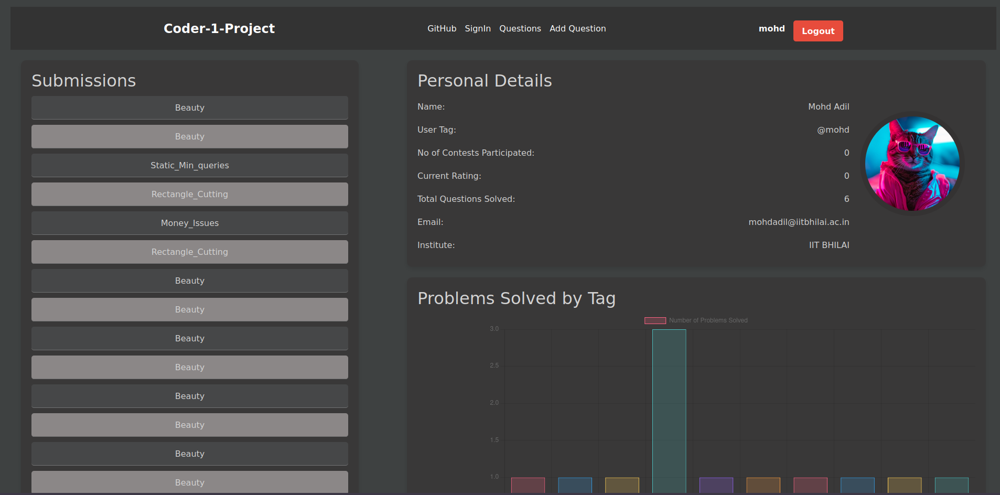
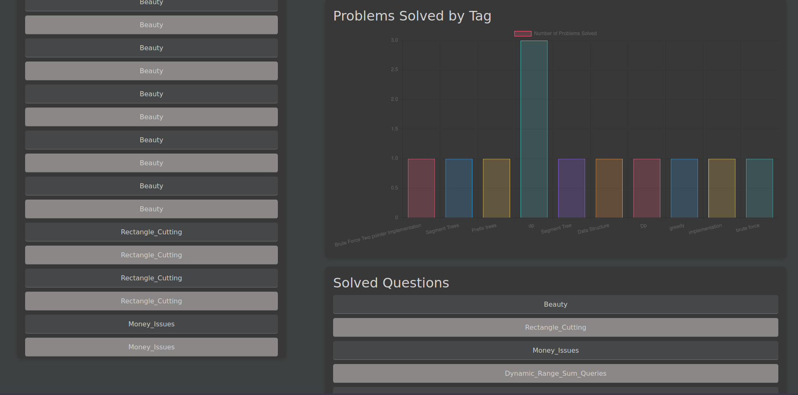
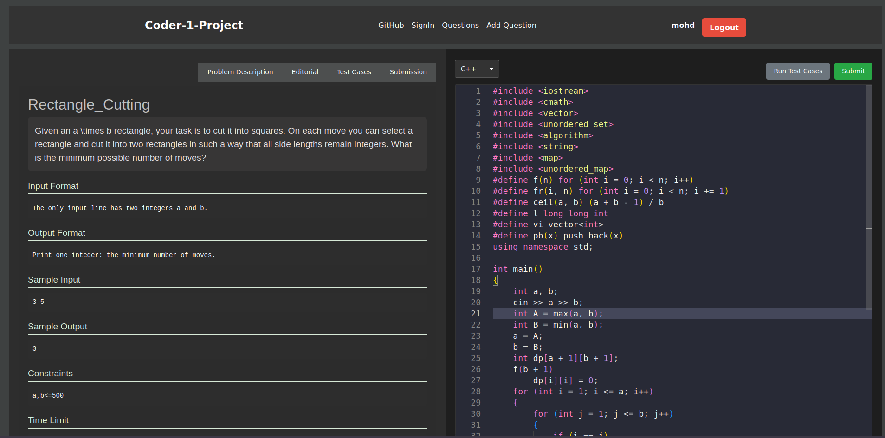
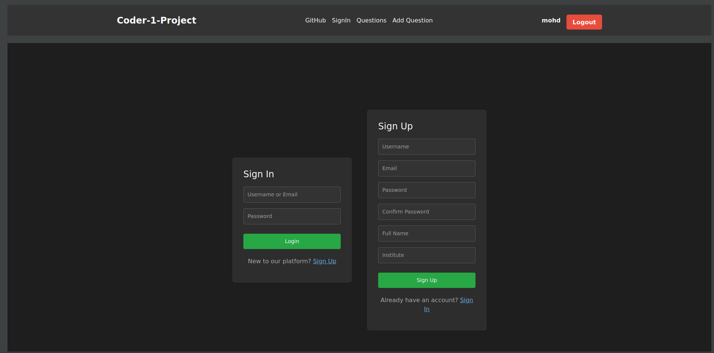
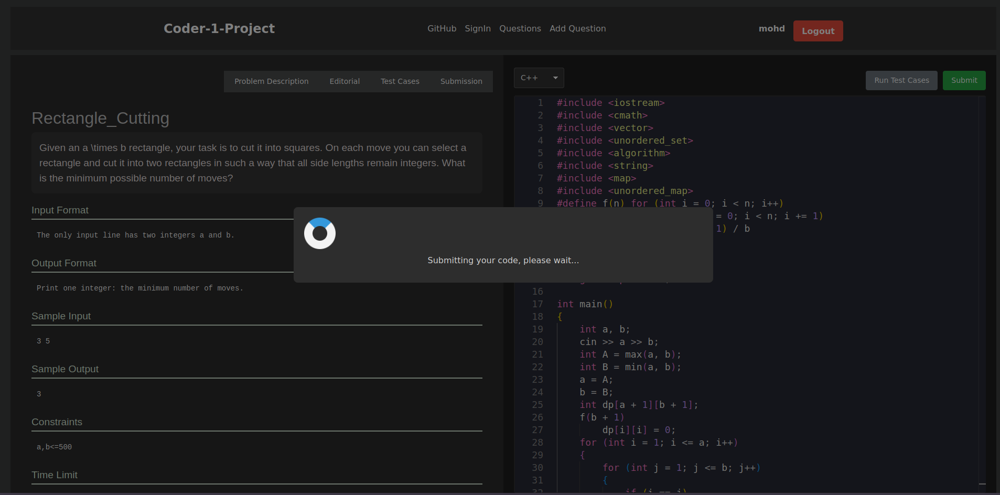
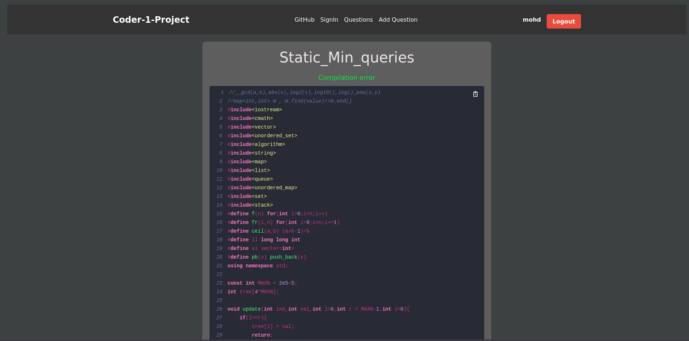

# 🎯 Coding Master - Competitive Programming & Problem Solving Platform

> **🚀 Coding Master** is a web-based platform developed for competitive programmers. This platform provides an all-in-one coding environment with problem-solving functionality, real-time submission evaluation, multi-language support, and an interactive code editor. Designed to enhance the coding experience, Coding Master offers users a secure, robust, and efficient way to tackle coding challenges, manage submissions, and improve problem-solving skills.

---

## 📑 Table of Contents

- [⭐ Features](#-features)
- [🏗️ Architecture](#️-architecture)
- [📦 Deployment](#-deployment)
- [🚀 Getting Started](#-getting-started)
- [🧪 Unit Testing](#-unit-testing)
- [📸 Screenshots](#-screenshots)
- [🌐 Live Demo](#-live-demo)
- [🤝 Contributing](#-contributing)

---

## ⭐ Features

- 🔐 **User Authentication**: Provides a secure login and registration system to manage user accounts.
- 📝 **Problem Management**: Allows users to add, view, and manage coding problems, displaying comprehensive problem statements, constraints, and examples.
- 💻 **Interactive Code Editor**: Features a powerful code editor with syntax highlighting, auto-completion, and support for multiple programming languages, enhancing the coding experience.
- ⚡ **Real-Time Submission & Judging**: Supports real-time code submission and judging, providing immediate feedback and handling errors gracefully.
- 🌍 **Multi-Language Support**: Allows users to submit solutions in multiple languages, using a Linux-based piping system to compile and evaluate code submissions.
- 🐳 **Dockerized Deployment**: Fully containerized using Docker, which allows for easy and consistent deployment across environments.
- ✅ **Testing & Reliability**: Thoroughly unit-tested components ensure reliability and stability of the platform.

---

## 🏗️ Architecture

### 🎨 Frontend

- 🔧 **Framework**: Built with **React.js** for a dynamic, responsive user interface.
- 📱 **UI Design**: Responsive and user-friendly, featuring interactive components for an optimal user experience.
- ⚙️ **State Management**: Efficient state handling across the application, ensuring smooth performance and quick response times.

### 🔧 Backend

- ⚡ **Framework**: **Node.js** with **Express.js** for API management.
- 🔌 **API Design**: RESTful APIs handle core platform functions, including problem management, submissions, and user authentication.
- 💾 **Database**: Utilizes **MongoDB** for data storage and retrieval, ensuring scalability and flexibility.
- 🚀 **Submission Judging**: Manages multi-language submissions with a **Linux-based piping system** to safely process user code.
- 📦 **Containerization**: Backend services are fully containerized with **Docker**, ensuring streamlined deployment and scalability.

---

## 📦 Deployment

🐳 Coding Master is designed to run seamlessly in a Dockerized environment, providing a consistent setup across different machines and deployment environments.

### Docker Deployment
1. 📥 Clone the repository:
   ```bash
   git clone <repository_url>
   ```
2. 📂 Navigate to the project directory:
   ```bash
   cd CodingMaster
   ```
3. 🏗️ Build and start the containers using Docker Compose:
   ```bash
   docker-compose up --build
   ```
4. 🌐 The platform will be accessible at `http://localhost:3000`.

---

## 🚀 Getting Started

### ⚡ Prerequisites

To run this project locally, ensure you have **Node.js** and **Docker** installed on your machine.

### 📝 Installation Guide

1. 📥 **Clone the Repository**  
   Begin by cloning the repository to your local machine:
   ```bash
   git clone <repository_url>
   ```
   
2. 📂 **Navigate to Project Directory**  
   Move into the project folder:
   ```bash
   cd CodingMaster
   ```

3. ⚙️ **Run the Install Script**  
   Execute the installation script to install necessary dependencies:
   ```bash
   ./install.sh
   ```

4. 🚀 **Start the Application**  
   After installation, start the application:
   ```bash
   npm start
   ```

5. 🌐 **Access the Platform**  
   Open your browser and visit `http://localhost:3000` to start using Coding Master.

---

## 🧪 Unit Testing

🔍 Coding Master has been extensively unit-tested to ensure stable and reliable functionality. Critical features, including problem management, submission handling, and the user interface, have been rigorously tested, providing a robust experience for users.

---

## 📸 Screenshots

🖼️ Get a glimpse of Coding Master's features and interface:

| Feature               | Screenshot                              |
|-----------------------|-----------------------------------------|
| 🏠 **User Dashboard**    |  |
| 📝 **Problem List**      |  |
| 💻 **Code Editor**       |  |
| 🔐 **Sign Up**           |       |
| ⚡ **Submitting Solution** |  |
| 📊 **Submissions Page**  |  |

---

## 🌐 Live Demo

✨ Experience the platform live here: [Coding Master Demo](https://masterit.vercel.app)

---

## 🤝 Contributing

🌟 We welcome contributions! To contribute to Coding Master, please fork the repository, create a new branch, and submit a pull request with a description of your changes. For any questions or issues, feel free to open a new issue in the repository.

<div align="center">

**💫 Thank you for checking out Coding Master! We look forward to seeing your contributions and feedback. 💫**

</div>